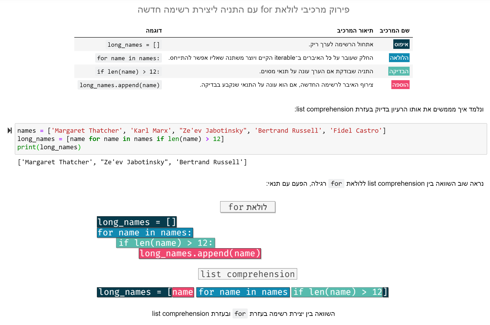

# קורס פייתון – מיזם חינמי ללימוד תכנות בעברית

מטרת המיזם "לומדים פייתון" היא להנגיש ידע בתכנות להמונים בצורה אינטואיטיבית ונוחה. המחברות בקורס נבנו מתוך ניסיון של עשור בהוראת המקצוע, ובהן חומר מפורט, דוגמאות רלוונטיות ותרגילים נלווים רבים בכל נושא. גם בימים אלו אנחנו ממשיכים לעדכן את המחברות ולסקור נושאים חדשים לעומקם.

## שימוש נכון במחברות

כדי להשתמש במחברות יש להיעזר ב־Jupyter Notebook – כלי שמאפשר לנו לצפות במחברות שבהן מלל ואיורים שהכנו עבורכם מראש. מדריך להתקנת הסביבה של פייתון ושל Jupyter Notebook נמצא [כאן](https://www.youtube.com/watch?v=lrUPmBpVQRw), ואפשר להוריד את המחברות ישירות מ[כאן](https://github.com/PythonFreeCourse/Notebooks/archive/master.zip).

מומלץ בחום להקדיש לכל מחברת בין יום לימודים אחד לשלושה ולפתור את כל התרגולים הנלווים. המחברות מחולקות באופן שמתאים ללימוד בקצב זה. לימוד מהיר מדי לא יאפשר לכם להטמיע את החומר, ובלימוד איטי מדי תתקשו לזכור חלק מהידע ועקב כך יקשה עליכם לחזור למסלול.

פתירת התרגילים היא חלק חשוב מאין כמוהו במסע שלכם – כפי שלא הייתם נותנים לחברכם לנהוג לאחר סיום קריאה של ספר התיאוריה, כך אתם עצמכם לא תדעו לתכנת עד שלא תפתרו את התרגילים. תרגול נכון יעזור לידע להיטמע ויאפשר לכם להבין את החומר לעומקו. אם יש לכם מכר שיודע פייתון היטב – תנו לו לבדוק את התרגילים שלכם. החניכים בקורסים שלי לאורך השנים העידו שמשוב מקצועי על התרגילים הוא אחד מכלי המפתח לשיפור עצום.

## דוגמה מתוך המחברות

## תודות

המחברות נכתבו על ידי [ים מסיקה](https://www.mesicka.com), בעזרתה הנדיבה של העורכת הלשונית [דפי בר אילן](https://www.dafibarilan.com/).
את מחברות הסיכום ברובן כתב איתמר רביב, ואת הלוגו עיצב [אליאל דן לוי](https://www.elielart.com/). למשתתפים נוספים ביצירת המחברות לחצו [פה](https://github.com/PythonFreeCourse/Notebooks/blob/master/AUTHORS.rst). 

